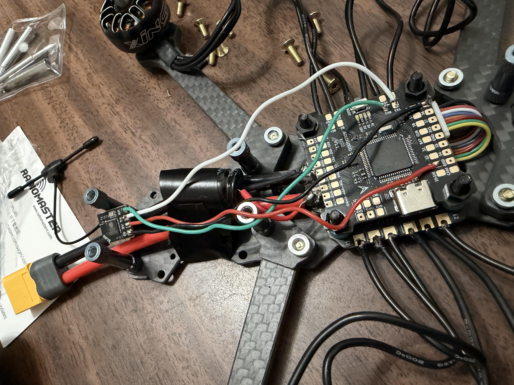
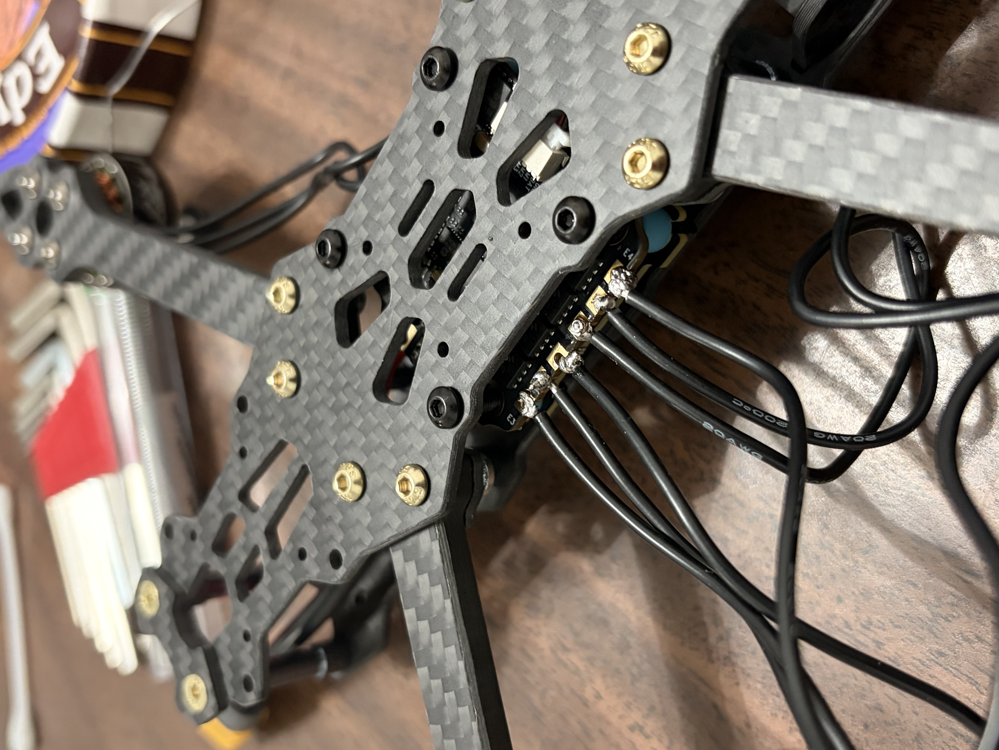

# Racing Drone 🛸

> Custom 5" racing quad — currently in the config + flashing phase.
> **Status:** assembled, working on flight controller setup, ESC config, and radio binding.

  

---

## ⚡ at a glance

| | |
|---|---|
| **Build start** | April 2026 |
| **Frame size** | 5" (225mm) |
| **Battery config** | 4S |
| **Current phase** | Config & software setup |
| **Next milestone** | First bench arm + motor test |

---

## 🔧 Bill of Materials (BOM)

### Drone hardware
| Component | Part | Notes |
|---|---|---|
| **Frame** | FPVDrone 225mm Carbon Fiber Freestyle Frame Kit | 5" quad, includes lipo battery strap |
| **Motors** | iFlight XING-E Pro 2207 2450KV (×4) | Brushless, 4S |
| **FC + ESC Stack** | SoloGood F722 FC + 4-in-1 60A BLS8 ESC | 30.5×30.5mm, dual BEC 5V/10V |
| **Receiver** | RadioMaster RP1 ELRS Nano (2.4GHz) | 65mm UFL T-antenna |
| **Props** | HQProp Ethix S5 Light Grey 5×4×3 (16pcs) | Tri-blade, 4S/6S compatible |
| **Connectors** | ZHOFONET XT60 (M+F, 12AWG) | 3 pairs w/ 5cm silicone wire |
| **Cable mgmt** | Skalon 8" Zip Ties (100 pack, 40lbs) | — |

### Radio / control
| Component | Part | Notes |
|---|---|---|
| **Transmitter** | Radiomaster Pocket (ELRS, Mode 2) | Hall gimbals, foldable antenna |

### Power / charging
| Component | Part | Notes |
|---|---|---|
| **Battery** | Zeee 4S 1500mAh 14.8V 120C Graphene LiPo (×2) | XT60 plug |
| **Charger** | ISDT 608PD Smart Charger | DC 240W / USB-C 100W, 1–6S LiPo |
| **LiPo safety** | Tenergy Fire-Retardant LiPo Bag (7×9") | For charging + storage |

### Tools
| Component | Part | Notes |
|---|---|---|
| **Soldering Iron** | 80W 110V LCD Digital Soldering Kit | 5 tips, stand, solder wire, paste, sponge |

> Estimated build cost so far: **~$550** (drone hardware + tools)

---

## 🛠️ config & setup log

*Tracking the software/firmware side of the build.*

- [ ] Flash Betaflight to SoloGood F722
- [ ] Configure ports (UART for ELRS, etc.)
- [ ] Bind RadioMaster RP1 receiver to Pocket TX
- [ ] ESC calibration / BLHeli_S (or BLHeli_32) config
- [ ] Set up rates, modes, arming switch
- [ ] Motor direction check
- [ ] Bench motor test (props off)
- [ ] First hover

---

## 📓 build notes

### Soldering the ESC + power leads
First time soldering on a 4-in-1 ESC. Took a few attempts to get clean joints — flux is your friend.

  

---

## 💡 lessons learned

- **Soldering takes practice.** First few joints looked rough. More flux, more heat, less solder than you'd think.
- **Plan your wire routing before you solder.** Cut wires too short the first time and had to redo a joint.
- **Tin everything first.** Pre-tin pads + wire ends → joints come out way cleaner.
- **Check motor wire order before final mounting.** Motor direction in Betaflight is easier to fix in software, but knowing CW/CCW up front saves headaches.
- **LiPo safety isn't optional.** Always charge in the bag. Always.

---

## 📫 contact

Neal Mehta — Mechanical Engineering @ Virginia Tech
[LinkedIn](https://linkedin.com/in/your-handle) · neal4146 on GitHub